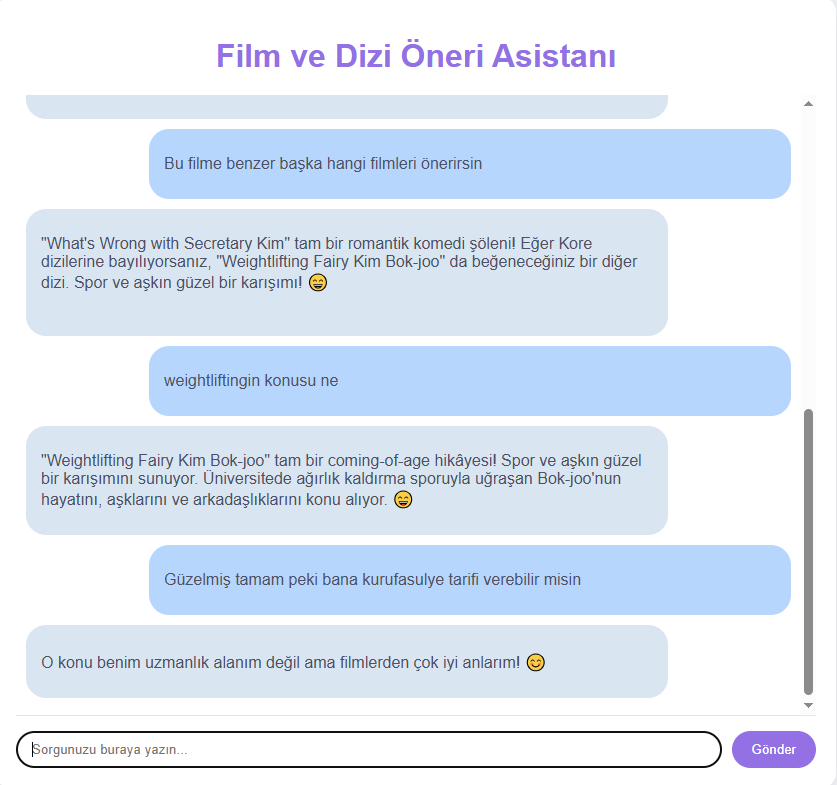
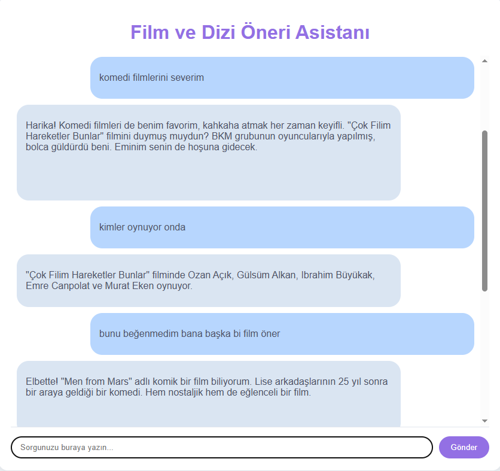
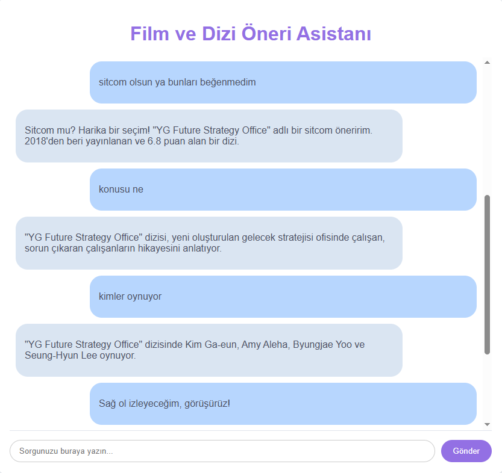

# 🎬 Film Buddy

Kişisel film ve dizi öneri asistanınız.


**Film Buddy**, doğal bir sohbet deneyimiyle size en uygun film ve dizi önerilerini sunmak için tasarlanmış akıllı bir asistandır. Ruh halinize, tercihlerinize ve geçmiş sohbetlerinize göre kişiselleştirilmiş öneriler yapar.

### 🤖 Nasıl Çalışır?

Film Buddy, sizinle tıpkı bir arkadaş gibi sohbet ederek film ve dizi önerileri sunar. Aklınızdaki bir türü, ruh halinizi veya sadece "ne izlesem?" sorunuzu yöneltmeniz yeterli.

* **Doğal Konuşma:** Film Buddy, "selam", "teşekkürler" gibi ifadeleri anlar ve buna göre yanıt verir.
* **Bağlamı Hatırlama:** Sizinle yaptığı sohbeti hatırlayarak, "o zaman başka bir tane öner" gibi devam cümlelerini bile kolayca anlar.
* **Kişiselleştirilmiş Öneriler:** Yaptığı öneriler, sizin tercihlerinize ve aradığınız türe göre şekillenir.

⚙️ Özellikler
- **Hibrit Arama (Ensemble Retriever):** Hem BM25 (anahtar kelime tabanlı) hem de Vektör Araması (anlamsal arama) teknolojilerini kullanarak en alakalı sonuçları bulur.
- **Doğal Niyet Sınıflandırması:** Kullanıcının amacını (öneri isteme, bilgi arama, selamlama vb.) anlar ve buna göre yanıt verir.
- **Akıllı Sohbet Yönetimi:** Konuşma geçmişini hatırlayarak tekrarlanan soruları algılar ve bağlamı korur.
- **Kişisel Film Rehberi:** Film ve diziler hakkında detaylı bilgilere (konu, oyuncular, yönetmen) kolayca ulaşmanızı sağlar.

### 🛠️ Kullanılan Teknolojiler

* **Python:** Projenin tüm backend mantığı Python ile yazılmıştır.
* **Flask:** Hafif ve hızlı bir framework olarak, arka uç ve ön uç arasındaki iletişimi sağlar.
* **LangChain:** RAG (Retrieval-Augmented Generation) sistemini kurmak ve dil modelleriyle verimli bir şekilde etkileşim kurmak için kullanılmıştır.
* **Sentence Transformers:** Metinleri anlamsal olarak anlamlı vektörlere dönüştürmek için kullanılan embedding modelidir.
* **ChromaDB:** Vektör veritabanı olarak, film ve dizi verilerinin hızlı aranmasını sağlar.
* **HTML, CSS, JavaScript:** Kullanıcı dostu ve interaktif sohbet arayüzünü oluşturmak için kullanılmıştır.

📂 Proje Yapısı

```
film-buddy/
│
├── classifiers/ # Niyet sınıflandırma modeli ve kodları
│ ├── init.py
│ └── sentence_transformer_classifier.py
├── data_handler.py # Veri yükleme ve doküman oluşturma
├── llm_model.py # LLM yönetimi ve sayaç
├── counter.py # Performans metriği
├── rag_system.py # RAG pipeline ve niyet sınıflandırma
├── rag_server.py # RAG sistemini sunucu tarafında çalıştırır
├── main.py # Ana giriş noktası
├── requirements.txt # Proje bağımlılıkları
├── static/ # HTML/CSS/JS gibi statik web dosyaları
│ ├── css/
│ ├── js/
├── templates/ # Flask HTML şablonları
│ └── index.html
├── .gitignore # Git tarafından göz ardı edilecek dosyalar
├── .github/ # Issue ve Pull Request şablonları
│ ├── ISSUE_TEMPLATE/
│ └── PULL_REQUEST_TEMPLATE.md
└── doc/ # Örnek veri seti
└── n_movies.csv
```

🛠 Kurulum

1. **Projeyi klonlayın:**
```bash
git clone https://github.com/zeynepcagil/FilmBuddy.git
cd film-buddy
```

2. **Gereklilikleri yükleyin:**
```bash
pip install -r requirements.txt
```

🚀 Kullanım

1. **Ana dosyayı çalıştırın:**
```bash
python main.py
```

2. **Kendi verinizi kullanmak için:** `main.py` dosyasındaki `csv_path` değişkenini kendi `.csv` veya `.txt` dosyanızın yoluna göre değiştirin.

📌 Örnek Kullanım


### 🤖 Nasıl Çalışır?

Film Buddy, sizinle tıpkı bir arkadaş gibi sohbet ederek film ve dizi önerileri sunar. Aklınızdaki bir türü, ruh halinizi veya sadece "ne izlesem?" sorunuzu yöneltmeniz yeterli.


Film Buddy'yi tanıyın! Basit bir merhaba ile sohbeti başlatın ve ruh halinizi paylaşın. Bot, önerilerini anında size göre kişiselleştirir.*


*Konuşmanın Bağlamını Anlar: "Benzer film önerisi" veya "konusu ne?" gibi soruları, önceki konuşmanıza göre doğru şekilde yanıtlar.*


*Konuşmanın Bağlamını Anlar: "Benzer film önerisi" veya "konusu ne?" gibi soruları, önceki konuşmanıza göre doğru şekilde yanıtlar.*


*Sadece verdiğiniz bağlama bağımlı kalır.*

---
### ⚖️ Lisans

Bu proje **[MIT Lisansı](LICENSE)** altında lisanslanmıştır.

🤝 Katkıda Bulunma

Projeye katkıda bulunmak için:
1. Bir `fork` oluşturun.
2. Yeni bir `branch` açın.
3. Değişikliklerinizi `commit`'leyin.
4. Bir `pull request` gönderin.
